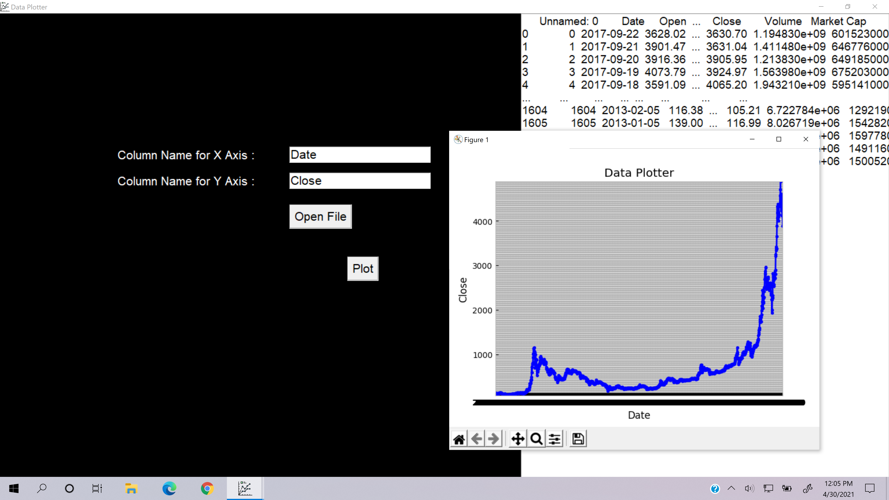

# Data Plotter
<div align="center">
  
</div>

## About
Data Plotter is an open source app for plotting data from CSV Files. It is licensed under the MIT License.

## Screenshots



## Downloads
Windows - [Download](https://github.com/K-Balaji/DataPlotter/releases/download/2.0.0/Data_Plotter_Setup.exe)

## Test Locally (For Windows, MacOS, Linux)

1. Install <a href="https://www.python.org/" target="_blank">Python</a>.
2. Download the above repository as a ZIP File.
3. Extract the ZIP File to a directory of your choice.
4. Open your terminal and navigate to that directory.
5. Enter the following in the terminal - 
```
cd src
python data_plotter.py
```

## Technologies used
- <a href="https://www.python.org/" target="_blank">Python</a>
- <a href="https://matplotlib.org/" target="_blank">Matplotlib</a>
- <a href="https://docs.python.org/3/library/tkinter.html" target="_blank">Tkinter</a>
- <a href="https://pandas.pydata.org/" target="_blank">Pandas</a>

## Future Plans
- More types of graphs
- Multiple plots on the same graph

## Contributing

To contribute to this project, make a pull request.

## License

[MIT License](./LICENSE)
