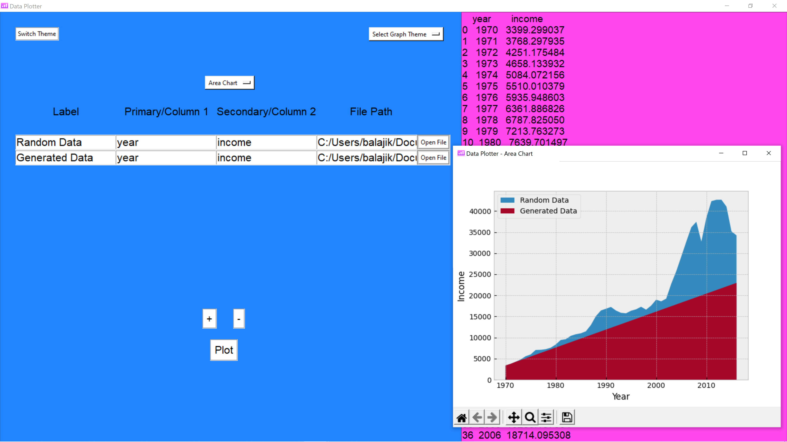

# Data Plotter
<div align="center">
  
</div>

## About
Data Plotter is an open source app for plotting graphs from data files.

## Screenshots




## Downloads
- Windows 10+ 64-bit Installer - [Download](https://github.com/K-Balaji/DataPlotter/releases/download/5.0.0/Data_Plotter_Setup.exe)

## Test Locally (For Windows, MacOS, Linux)

1. Install <a href="https://www.python.org/" target="_blank">Python</a>.
2. Download this [ZIP Folder](https://github.com/K-Balaji/DataPlotter/archive/refs/tags/5.0.0.zip) or this [tar.gz File](https://github.com/K-Balaji/DataPlotter/archive/refs/tags/5.0.0.tar.gz).
3. Extract it to a directory of your choice.
4. Open your terminal and navigate to that directory.
5. Enter the following in the terminal - 
```
pip install -r requirements.txt
cd src
python main.py
```

## Technologies used
- <a href="https://www.python.org/" target="_blank">Python</a>
- <a href="https://matplotlib.org/" target="_blank">Matplotlib</a>
- <a href="https://docs.python.org/3/library/tkinter.html" target="_blank">Tkinter</a>
- <a href="https://pandas.pydata.org/" target="_blank">Pandas</a>
- <a href="https://pypi.org/project/openpyxl" target="_blank">Openpyxl</a>

## Contributing

To contribute to this project, make a pull request.

## Credits
Icon by [Freepik](https://www.freepik.com/)

## License

[MIT License](./LICENSE)
